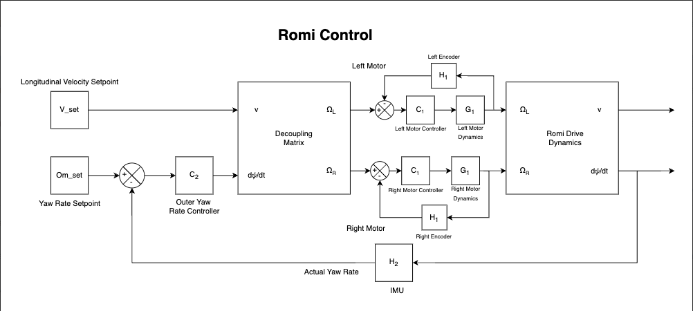

Control
=======

Our Romi is a relatively linear system with mostly simple sensors which points us to the
ever-reliable PID controller. Due to the noise, and time constraints, of most of our signals, we decided to use PI control.

We have a cascading control scheme that closes the loop with multiple sensors.
Our controller starts with a path pointing sensor such as our line sensor or the heading
reading from our IMU. This signal is processed to tell each motor what speed it should
go to achieve the goal of our outmost controller.

The speeds that are sent to the
motors are monitored by another PI controller via the encoder. This allows us to accurately
follow a line, go in a straight line and individually tune each system.

// update block diagram to agree with actual implementation

line sensor or IMU --> error --> motor set points --> PI motors -->(to start) PI path signal

