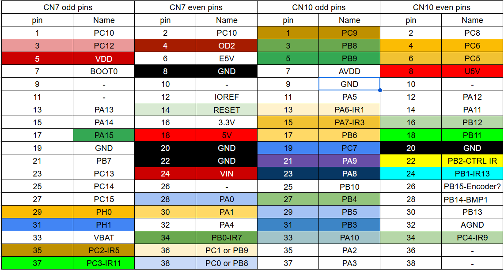
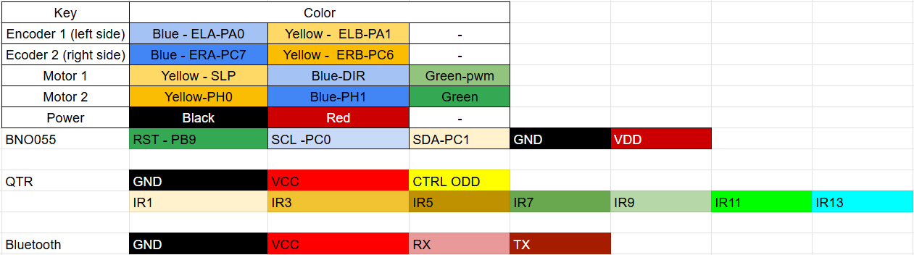

Assembly
========

Everything is bolted together with each component being designed to work well. Our QTR sensor is placed very close
to the ground for the most accurate and reliable reading. The bump sensor is bolted in out in front of the Romi.

Pinout
------

These are the pinouts pertaining to the components and STM32 Nucleo Board.

