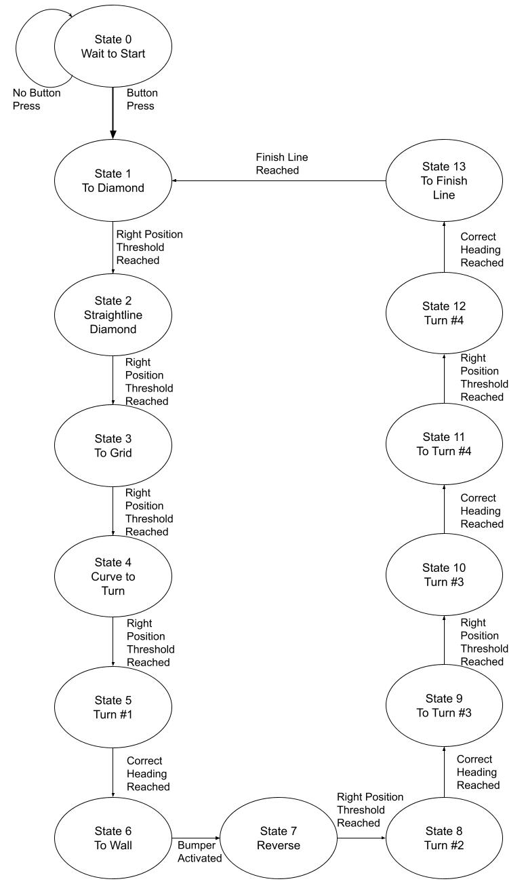
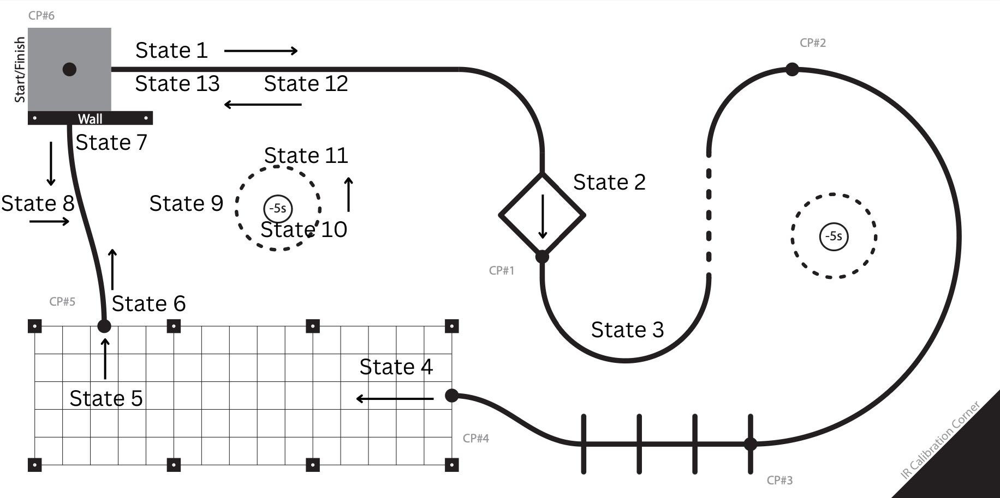

Programming
===========

Written in micropython, our codebase is devised of scheduler based tasks written as finite state machines
with shared variables. Each peripheral has its own class with task class to handle its integration.

Tasks
-----

We use Cal Poly's `ME405-Support libraries <https://spluttflob.github.io/ME405-Support/index.html>`_
which provide the python files for implementation of tasks, shares and queues. This allows us to time
when we get sensor readings, drive motors and use our controller. Shares allow us to have variables
that different tasks can use and change. For example, our controller task can adjust the motor speed
share which the motor task reads and uses to drive the motors to achieve a goal.

// insert updated task diagram --> only include the tasks we are using in the final project

Shares
------

.. list-table::
   :widths: 30 20 70
   :header-rows: 1

   * - Shared Variable
     - Data Type
     - Purpose
   * - right_pos
     - signed float
     - Encoder position in ticks of right motor
   * - left_pos
     - signed float
     - Encoder position in ticks of left motor
   * - right_vel
     - signed float
     - Velocity of right motor in ticks/us
   * - left_vel
     - signed float
     - Velocity of left motor in ticks/us
   * - right_speed
     - signed int
     - Desired direction and PWM % of right motor
   * - left_speed
     - signed int
     - Desired direction and PWM % of left motor
   * - right_stop
     - signed int
     - Value of stop state of right motor (0 on, 1 off)
   * - left_stop
     - signed int
     - Value of stop state of left motor (0 on, 1 off)
   * - line_error
     - signed float
     - Error value of black line under line sensor
   * - heading
     - signed float
     - Current heading reading from IMU in degrees
   * - heading_set
     - signed float
     - Desired heading angle in degrees
   * - line_heading
     - signed int
     - Value determining controller state, (0, line following; 1 or -1 (reverse), heading following; 2, in place heading following
       (turn); 3, straight reverse; 4, stop)

Finite State Machines
---------------------

Each our tasks use generators written as finite state machines (FSM)
Idk why but this FSM isnt updating from old jpg

In main, we use a FSM to complete the course. It features hardcoded encoder position thresholds which jump between
line following, heading following and full reverse modes.

Course FSM
----------

Line Sensing Methods
--------------------

Our line sensor features an array of light sensor that all produce a reading that can be normalized to 0 to 1 with a
1 being black. If the line is perfectly below the sensor, we get a 'normal' distribution with the middle sensors
reporting a 1 while each sensor moving outwards has less black line under it. We use this theory to find the
centroid of our sensor array which we can compare to the centroid of a perfectly centered line.

.. math::
    x = \frac{\sum_{i}q_i x_i}{\sum_{i}q_i}

where  :math:`q_i` is the sensor value and :math:`x_i` is the sensor location

This is sent to our controller which tells the motors what to do to realign the robot with line.

